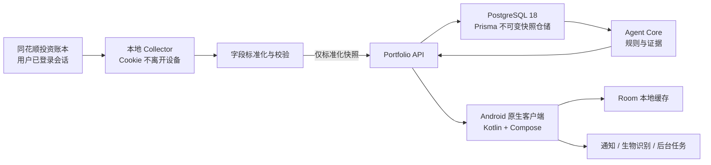

# Architecture

## 总体结构

Android 客户端只负责显示、离线缓存和用户交互。采集凭证、模型密钥、Agent 工具编排与数据写入权限不会进入 APK。

## 组件职责

### Collector

- 只在用户设备运行，使用用户主动登录后已有的会话。
- 获取账户、持仓、行情、成交和资金变化的只读数据。
- 将多接口字段组合为版本化快照，并与官方导出抽查对账。
- 只上传标准化快照，不上传 Cookie、券商账号或浏览器目录。
- 遇到验证码、登录失效或风控时停止并提示用户处理。

### Portfolio API

- 使用共享契约校验采集器提交的数据与采集时间。
- 写入接口要求独立的 Bearer Secret；读接口后续接入用户登录。
- 保存不可变快照，并为行业分布、历史曲线与 Agent 结果提供查询。
- 生产入口使用 Prisma + PostgreSQL；数据库不可用时启动失败，健康检查返回不可用。
- 同一快照重复提交是幂等操作；相同 ID 对应不同内容时拒绝覆盖。

### Agent Core

- 输入是已校验的 `PortfolioSnapshot`，不直接访问 Cookie 或浏览器。
- 第一阶段为确定性规则：数据新鲜度、单股集中度、现金缓冲。
- 每条结论必须带证据引用、时间和置信度。
- 模型能力未来作为解释层接入，不改变证据与运行记录结构。
- 不产生自动下单指令。

### Android Client

- Kotlin + Jetpack Compose 实现原生界面，Navigation 管理概览、持仓、Agent 和详情路由。
- ViewModel 暴露单向 UI 状态；数据仓储优先请求 API，失败时读取 Room，最后回退到明确标注的虚构演示数据。
- Debug 构建允许访问本机 HTTP 服务；Release 禁止明文流量，生产地址必须使用 HTTPS。
- 第一阶段只读；未来的敏感动作必须通过后端授权，并在设备侧进行明确确认或生物识别。

### Agent Backend

- `PortfolioAgentService` 是编排边界，当前调用确定性 evidence-first 规则核心。
- `POST /v1/agent/runs` 允许客户端基于最新快照重新分析；运行结果写入仓储后由看板返回。
- 将来接入模型时只能解释已登记证据，不能直接读取 Collector 会话或执行交易。

## 数据新鲜度

每个快照必须同时保存：

- `capturedAt`：采集器抓取时间。
- `sourceSyncedAt`：同花顺最近一次同步券商数据的时间。
- `freshness`：由采集与源同步时间共同计算的状态。

界面和 Agent 必须优先披露源数据过期，不能把旧数据描述为“今日最新持仓”。

## 后续演进点

- Collector 当前实现 → 每日调度、登录失效提醒与更多账户边界验证。
- Bearer Secret → 用户登录、设备绑定和短期上传令牌。
- 本地确定性规则 → 规则编排 + 模型解释 + 通知渠道。
- 单机 PostgreSQL → 加密托管数据库、自动备份、恢复演练和保留策略。
