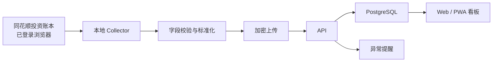

# Architecture

## 推荐结构

## 组件职责

### Collector

- 只在用户设备运行。
- 使用用户已存在的登录状态。
- 获取账户列表、持仓、行情、当日成交和资金变化。
- 计算网页导出中需要的衍生字段。
- 不上传 Cookie、券商账号或浏览器目录。

### API

- 校验采集器提交的数据结构和采集时间。
- 去重并保存不可变快照。
- 计算相邻快照之间的新增、加仓、减仓和清仓。
- 向 Web 提供聚合后的只读查询。

### Web

- 电脑和手机响应式布局。
- 第一屏展示总资产、股票市值、现金、仓位和数据新鲜度。
- 组合构成展示行业、个股和集中度。
- 变化页展示快照差异，不输出交易建议。

## 数据新鲜度

每个快照必须同时保存：

- `capturedAt`：采集器抓取时间。
- `sourceSyncedAt`：同花顺最近一次同步券商数据的时间。

如果源同步时间过旧，界面必须醒目标记，不能把旧数据描述为“今日最新持仓”。

